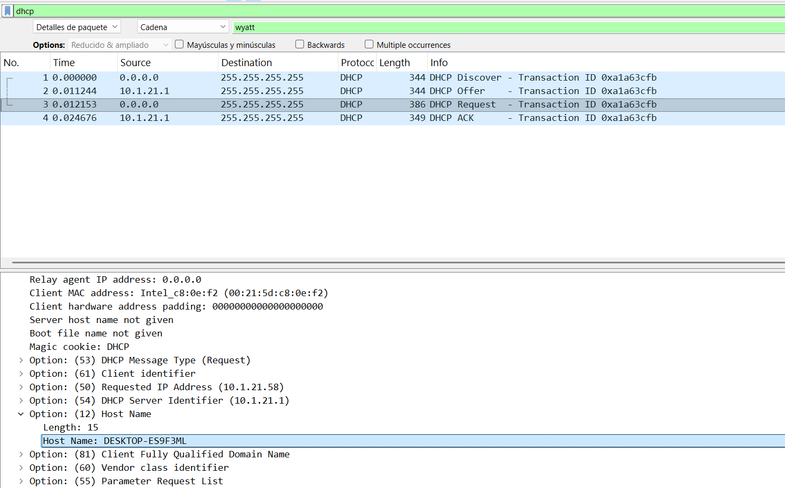
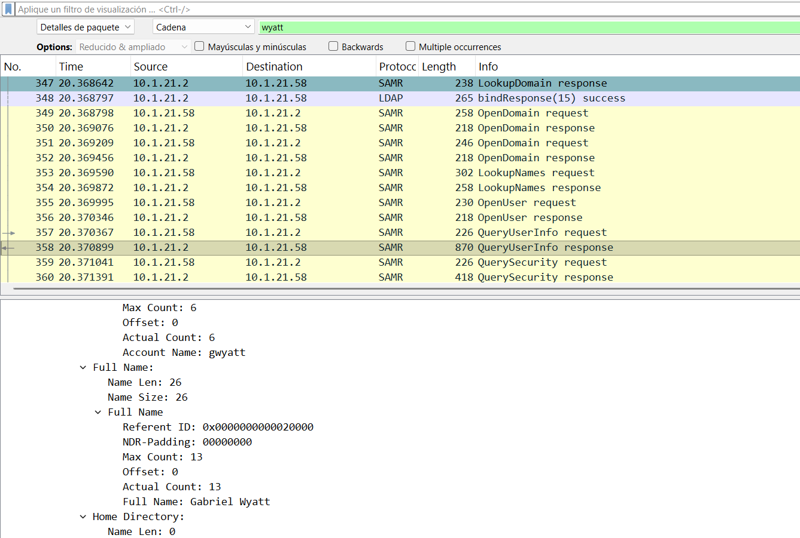
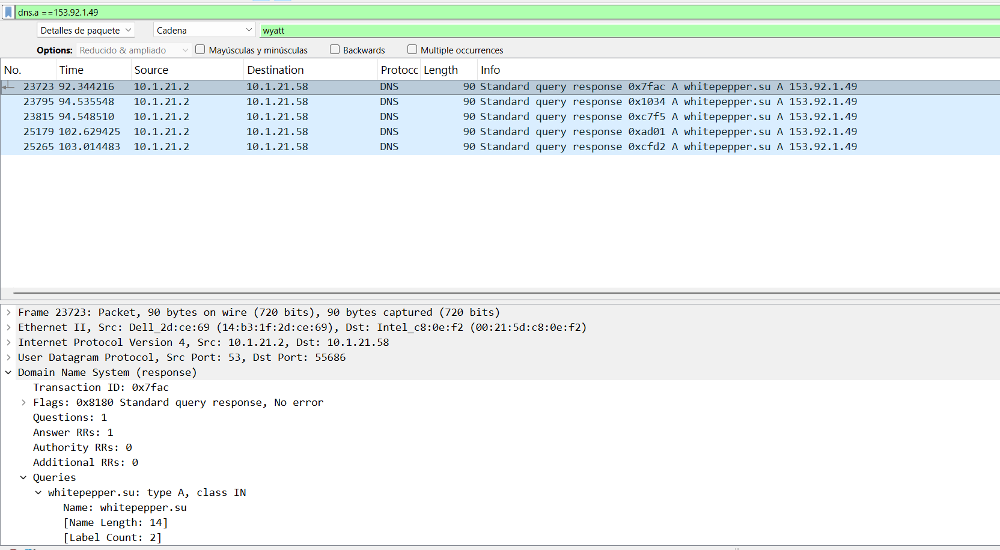

#   Reporte de Análisis Forense: Infección Lumma Stealer
**Fecha:** 16 de Febrero, 2026  
**ID de Incidente:** INC-2026-001  
**Analista:** MARCOS GASTON GUEVARA 
**Gravedad:**  CRÍTICA

---

## 1. Resumen Ejecutivo
Se ha realizado un análisis forense de red tras una alerta de seguridad por comunicación con infraestructura maliciosa. El análisis confirma que el equipo **10.1.21.58** ha sido comprometido por el malware **Lumma Stealer**, estableciendo conexiones de Comando y Control (C2) con el dominio externo `whitepepper.su`.

---

## 2. Información del Host Afectado (Víctima)
Mediante el análisis del protocolo DHCP, se han extraído los identificadores únicos del sistema comprometido:

| Parámetro | Valor |
| :--- | :--- |
| **Dirección IP** | `10.1.21.58` |
| **Dirección MAC** | `00:21:5d:c8:0e:f2` |
| **Nombre de Host** | `DESKTOP-ES9F3ML` |
| **Dominio de Red** | `WIN11OFFICE` |

### Evidencia Técnica (Hostname):
Se identificó el equipo mediante la **Opción 12** del protocolo DHCP.

---

## 3. Identificación del Usuario
Mediante el rastreo de paquetes de autenticación y la búsqueda de cadenas en el tráfico de red, se determinó la identidad del usuario afectado:

* **Nombre de Cuenta:** `gwyatt`
* **Nombre Completo:** `Gabriel Wyatt`

### Evidencia Técnica (Identidad):
El usuario fue localizado mediante la respuesta `QueryUserInfo` en el tráfico SMB2/SAMR.

---

## 4. Indicadores de Compromiso (IoCs)
Se identificó comunicación activa con el servidor de Comando y Control (C2) del atacante:

* **Dominio Malicioso:** `whitepepper.su`
* **Dirección IP C2:** `153.92.1.49`
* **Puerto:** `80 (HTTP)`

### Evidencia Técnica (DNS):
Relación entre la IP maliciosa y la resolución del dominio mediante el filtro `dns.a == 153.92.1.49`.

---

## 5. Cronología del Análisis (Metodología)
Para la resolución de este caso se aplicaron los siguientes filtros en Wireshark:
1. **Filtro DHCP:** `bootp` para identificar el nombre del dispositivo.
2. **Filtro de Usuario:** Búsqueda por cadena "Wyatt" en detalles de paquetes.
3. **Filtro de Dominio:** `dns.a == 153.92.1.49` para confirmar la resolución del nombre malicioso.

---

## 6. Conclusiones y Recomendaciones
El comportamiento del tráfico es consistente con las tácticas de **Lumma Stealer**, especializado en exfiltración de credenciales.

**Pasos recomendados:**
1. **Aislamiento inmediato** del host `10.1.21.58` de la red.
2. **Cambio de contraseñas** obligatorio para el usuario `Gabriel Wyatt`.
3. **Análisis de persistencia** en el equipo antes de proceder con el re-formateo.

---

*Reporte generado con fines de entrenamiento en ciberseguridad.*

